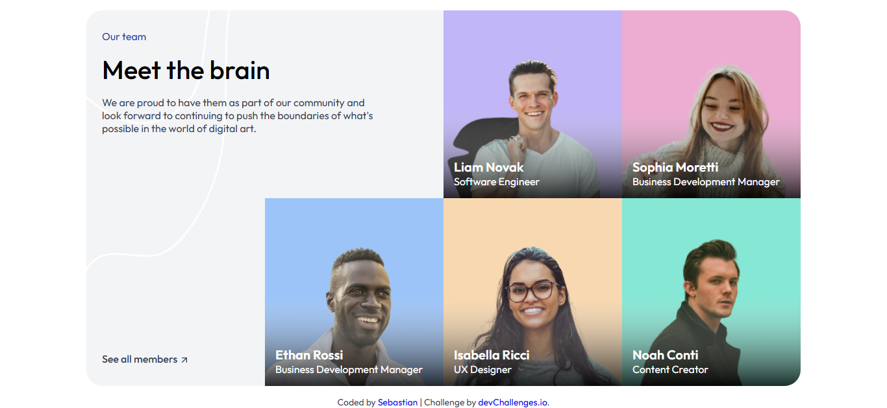

<h1 align="center">Meet the Team Section</h1>

   Solution for a challenge <a href="https://devchallenges.io/challenge/meet-the-team-section-challenge" target="_blank">Meet the Team Section</a> from <a href="http://devchallenges.io" target="_blank">devChallenges.io</a>.

  <h3>
    <a href="https://sebascode20.github.io/team-layout/">
      Demo
    </a>
     | 
    <a href="https://github.com/Sebascode20/team-layout">
      Solution
    </a>
     | 
    <a href="https://devchallenges.io/challenge/meet-the-team-section-challenge">
      Challenge
    </a>
  </h3>

<!-- TABLE OF CONTENTS -->

## Table of Contents

- [Overview](#overview)
  - [What I learned](#what-i-learned)
  - [Useful resources](#useful-resources)
- [Built with](#built-with)
- [Features](#features)
- [Contact](#contact)
- [Acknowledgements](#acknowledgements)

<!-- OVERVIEW -->

## Overview

This project is a responsive "Meet the Team" section designed to showcase team members in a visually appealing grid layout. The design features a clean, modern aesthetic with vibrant color-coded cards for each team member, creating an engaging way to present team information.

The layout adapts seamlessly across different screen sizes, using CSS Grid to create a dynamic 4-column grid on desktop that transforms into a 3-column layout on tablets and a single-column stack on mobile devices.

### What I learned

Through this project, I improved my skills in several key areas:

- **CSS Grid Layout**: Mastered advanced grid techniques including `grid-template-rows`, `grid-template-columns`, `grid-row`, `grid-column`, and `grid-auto-flow` to create complex, responsive layouts without relying on media queries for structural changes.

- **Responsive Design**: Learned how to implement breakpoints using `@media` queries to transform the layout from a 4-column desktop view to a mobile-friendly single-column stack, ensuring a consistent user experience across all devices.

- **CSS Custom Properties**: Utilized CSS variables (`:root`) to maintain a consistent color scheme and make global style changes easier to manage, improving code maintainability.

- **Semantic HTML**: Applied proper HTML5 semantic elements like `<main>`, `<section>`, `<article>`, `<header>`, and `<footer>` to improve accessibility and SEO.

- **Picture Element**: Implemented responsive images using the `<picture>` element with `srcset` to serve different image sizes based on viewport width, optimizing performance.

- **Design Implementation**: Developed skills in translating a design mockup into code, paying attention to details like border-radius, spacing, and visual effects such as gradient overlays.

### Useful resources

- [CSS Grid Guide - MDN](https://developer.mozilla.org/en-US/docs/Web/CSS/CSS_Grid_Layout) - Comprehensive documentation on CSS Grid Layout
- [A Complete Guide to Flexbox - CSS-Tricks](https://css-tricks.com/snippets/css/a-guide-to-flexbox/) - Essential reference for Flexbox properties
- [Responsive Images - MDN](https://developer.mozilla.org/en-US/docs/Learn/HTML/Multimedia_and_embedding/Responsive_images) - Guide to implementing responsive images with srcset
- [CSS Custom Properties - MDN](https://developer.mozilla.org/en-US/docs/Web/CSS/Using_CSS_custom_properties) - Documentation on CSS variables

## Built with

- Semantic HTML5 markup
- CSS custom properties (CSS Variables)
- CSS Grid Layout
- Flexbox
- Responsive design with media queries
- Google Fonts (Outfit)

## Features

- **Responsive Layout**: Adapts from 4-column grid (desktop) to 3-column (tablet) to single-column (mobile)
- **Color-coded Cards**: Each team member has a unique background color for visual distinction
- **Gradient Overlays**: Subtle gradient effects on team member images
- **Smooth Transitions**: Hover effects and smooth layout changes
- **Accessible Design**: Semantic HTML structure with proper alt text for images
- **Optimized Images**: Responsive images using srcset for different screen sizes

## Acknowledgements

- [devChallenges.io](https://devchallenges.io) for providing this challenge and the opportunity to practice frontend skills
- The design inspiration for the team card layout
- Google Fonts for the Outfit typeface

## Contact

- GitHub [@Sebascode20](https://github.com/Sebascode20)
